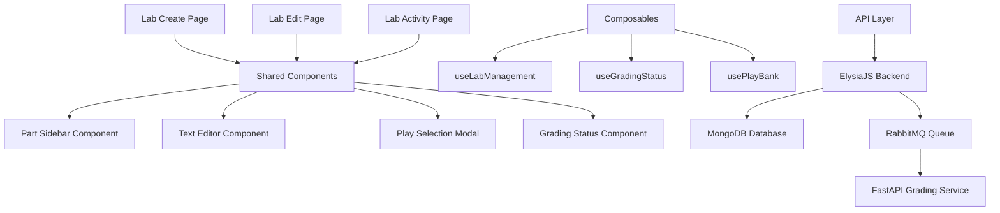
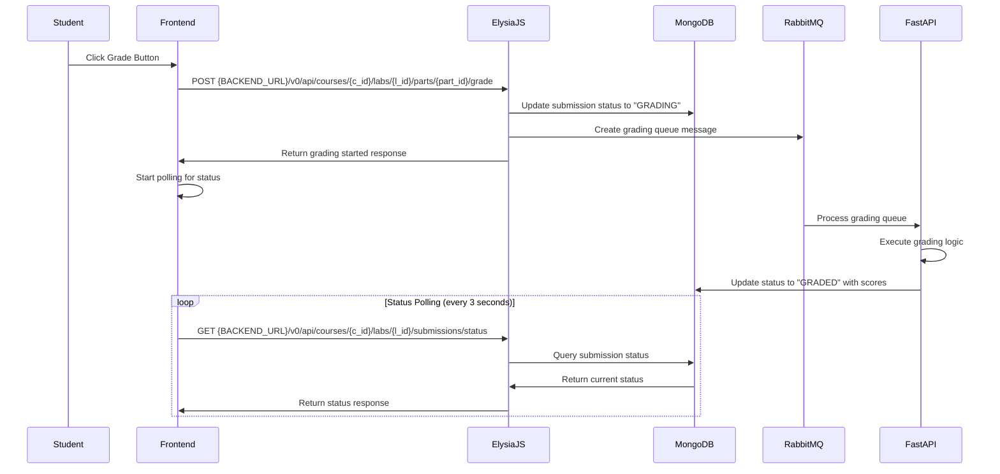

# Design Document

## Overview

The Lab Management System is a comprehensive feature for NetGrader that enables lecturers to create and manage laboratory exercises while providing students with an interactive platform to complete assignments. The system consists of three main interfaces: Lab Create, Lab Edit, and Lab Activity pages, integrated with an automated grading workflow using RabbitMQ and FastAPI.

The system leverages Nuxt 3 with Vue 3 composition API, shadcn-vue components, and Tailwind CSS for the frontend, while integrating with an ElysiaJS backend and MongoDB database for data persistence and grading orchestration.

## Architecture

### Variable System Architecture

The key innovation to solve the Play reusability challenge is a **Variable System** that separates static Play definitions from dynamic runtime values:

```mermaid
graph TB
    A[Play Template] --> B[Variable Definitions]
    B --> C[Runtime Context]
    C --> D[Variable Resolution]
    D --> E[Personalized Tasks]
    
    F[Student Group] --> C
    G[Exam Mode] --> C
    H[Course Context] --> C
    
    I[IP Template: 192.168.{group_number}.5] --> D
    J[Group Number: 3] --> D
    D --> K[Resolved IP: 192.168.3.5]
```

**How it works:**
1. **Play Templates**: Plays contain variable placeholders (e.g., `{group_number}`, `{vlan_id}`)
2. **Variable Definitions**: Each Play defines what variables it needs and their types
3. **Runtime Resolution**: When a student accesses a lab or exam, variables are resolved based on:
   - **Lab Mode**: Student's group assignment (collaborative work)
   - **Exam Mode**: Individual student ID (personalized configurations)
   - Course-specific settings
4. **Personalized Tasks**: Each student gets the same Play structure but with personalized values

This approach ensures:
- **Reusability**: Same Play can be used for both labs and exams across different courses
- **Flexibility**: Variables resolved differently:
  - **Labs**: Group-based (e.g., `192.168.{group_number}.5` → `192.168.3.5`)
  - **Exams**: Individual student-based (e.g., `172.{dec2}.{dec3}.65` → `172.15.232.65`)
- **Maintainability**: Play logic stays separate from instance-specific data

### Frontend Architecture



### Backend Integration Flow



## Components and Interfaces

### 1. Page Components

#### Lab Create Page (`/pages/courses/[c_id]/labs/create.vue`)
- **Purpose**: Allow lecturers to create new laboratory exercises within a specific course
- **Layout**: Part sidebar (left) + Text editor (right)
- **Key Features**:
  - Dynamic part management with tab-like interface
  - Rich text editor with formatting options
  - Play selection modal integration
  - Group management toggle (optional groups)
  - Save/Cancel functionality
  - Course context integration

#### Lab Edit Page (`/pages/courses/[c_id]/labs/[l_id]/edit.vue`)
- **Purpose**: Enable editing of existing laboratory exercises within course context
- **Layout**: Identical to create page with pre-populated data
- **Key Features**:
  - Data loading from database
  - Preservation of existing content structure
  - Update functionality
  - Course and lab ID context

#### Lab Activity Page (`/pages/courses/[c_id]/labs/[l_id]/index.vue`)
- **Purpose**: Student interface for completing lab exercises within course context
- **Layout**: Read-only version of lab interface with grading controls
- **Key Features**:
  - Sequential part progression
  - Grading submission workflow
  - Real-time status updates
  - Group-based variable resolution
  - Course and lab context for proper navigation

#### Exam Create Page (`/pages/courses/[c_id]/exams/create.vue`)
- **Purpose**: Allow lecturers to create individual examination exercises with personalized configurations
- **Layout**: Similar to lab create but with exam-specific controls
- **Key Features**:
  - Same part sidebar and text editor interface
  - Mandatory CSV upload for student enrollment (no groups)
  - Subnet generation algorithm configuration
  - Exam mode settings (time limits, randomization)
  - Play selection with variable preview
  - Enhanced security settings

#### Exam Edit Page (`/pages/courses/[c_id]/exams/[e_id]/edit.vue`)
- **Purpose**: Enable editing of existing examination exercises
- **Layout**: Identical to exam create page with pre-populated data
- **Key Features**:
  - Data loading with exam-specific configurations
  - Student enrollment management interface
  - Subnet generation preview
  - Exam settings modification

#### Exam Activity Page (`/pages/courses/[c_id]/exams/[e_id]/index.vue`)
- **Purpose**: Student interface for taking examinations with personalized configurations
- **Layout**: Similar to lab activity but with exam-specific features
- **Key Features**:
  - Personalized network configurations per student
  - Subnet generation-based variable resolution
  - Time tracking and limits
  - Enhanced security measures
  - Individual grading with unique answer keys

### 2. Shared Components

#### Part Sidebar Component (`/components/lab/PartSidebar.vue`)
```vue
<template>
  <div class="w-64 bg-sidebar border-r border-sidebar-border">
    <div class="p-4">
      <h3 class="font-semibold text-sidebar-foreground mb-4">Lab Parts</h3>
      <div class="space-y-2">
        <div
          v-for="(part, index) in parts"
          :key="part.id"
          :class="[
            'flex items-center justify-between p-3 rounded-lg cursor-pointer transition-colors',
            currentPart === index 
              ? 'bg-sidebar-accent text-sidebar-accent-foreground' 
              : 'hover:bg-sidebar-accent/50'
          ]"
          @click="selectPart(index)"
        >
          <span>Part {{ index + 1 }}</span>
          <Badge v-if="part.status" :variant="getStatusVariant(part.status)">
            {{ part.status }}
          </Badge>
        </div>
      </div>
      <Button
        v-if="canAddParts"
        @click="addPart"
        class="w-full mt-4"
        variant="outline"
      >
        <Plus class="w-4 h-4 mr-2" />
        Add Part
      </Button>
    </div>
  </div>
</template>
```

#### Text Editor Component (`/components/lab/TextEditor.vue`)
```vue
<template>
  <div class="flex-1 flex flex-col">
    <div class="border-b border-border p-4">
      <Input
        v-model="partTitle"
        placeholder="Part Title (Required)"
        class="text-lg font-semibold"
        :readonly="readonly"
      />
    </div>
    
    <div v-if="!readonly" class="border-b border-border p-2">
      <div class="flex items-center space-x-2">
        <Button variant="ghost" size="sm" @click="toggleBold">
          <Bold class="w-4 h-4" />
        </Button>
        <Button variant="ghost" size="sm" @click="toggleItalic">
          <Italic class="w-4 h-4" />
        </Button>
        <Separator orientation="vertical" class="h-6" />
        <Select v-model="fontSize">
          <SelectTrigger class="w-20">
            <SelectValue />
          </SelectTrigger>
          <SelectContent>
            <SelectItem value="12">12px</SelectItem>
            <SelectItem value="14">14px</SelectItem>
            <SelectItem value="16">16px</SelectItem>
            <SelectItem value="18">18px</SelectItem>
          </SelectContent>
        </Select>
        <ColorPicker v-model="textColor" />
      </div>
    </div>
    
    <div class="flex-1 p-4">
      <div
        ref="editorRef"
        :contenteditable="!readonly"
        class="min-h-96 prose prose-sm max-w-none focus:outline-none"
        @input="updateContent"
        v-html="content"
      />
    </div>
    
    <div v-if="!readonly" class="border-t border-border p-4">
      <Button @click="openPlayModal" variant="outline">
        <Settings class="w-4 h-4 mr-2" />
        Select Play
      </Button>
      <span v-if="selectedPlay" class="ml-4 text-sm text-muted-foreground">
        Play: {{ selectedPlay.name }}
      </span>
    </div>
  </div>
</template>
```

#### Play Selection Modal (`/components/lab/PlaySelectionModal.vue`)
```vue
<template>
  <Dialog v-model:open="isOpen">
    <DialogContent class="max-w-2xl">
      <DialogHeader>
        <DialogTitle>Select Play from Play Bank</DialogTitle>
        <DialogDescription>
          Choose a grading flow for this lab part
        </DialogDescription>
      </DialogHeader>
      
      <div class="max-h-96 overflow-y-auto">
        <div class="grid gap-4">
          <Card
            v-for="play in plays"
            :key="play.id"
            :class="[
              'cursor-pointer transition-colors',
              selectedPlayId === play.id 
                ? 'ring-2 ring-primary' 
                : 'hover:bg-accent'
            ]"
            @click="selectPlay(play)"
          >
            <CardHeader>
              <CardTitle class="text-lg">{{ play.name }}</CardTitle>
              <CardDescription>{{ play.description }}</CardDescription>
            </CardHeader>
            <CardContent>
              <div class="text-sm text-muted-foreground">
                <p>Tasks: {{ play.taskCount }}</p>
                <p>Total Points: {{ play.totalPoints }}</p>
              </div>
            </CardContent>
          </Card>
        </div>
      </div>
      
      <DialogFooter>
        <Button variant="outline" @click="cancel">Cancel</Button>
        <Button @click="confirm" :disabled="!selectedPlayId">
          Select Play
        </Button>
      </DialogFooter>
    </DialogContent>
  </Dialog>
</template>
```

#### Grading Status Component (`/components/lab/GradingStatus.vue`)
```vue
<template>
  <div class="border-t border-border p-4">
    <div v-if="status === 'not_submitted'" class="space-y-4">
      <Button @click="submitForGrading" class="w-full" :disabled="isSubmitting">
        <span v-if="!isSubmitting">Submit for Grading</span>
        <span v-else class="flex items-center">
          <Loader2 class="w-4 h-4 mr-2 animate-spin" />
          Submitting...
        </span>
      </Button>
    </div>
    
    <div v-else-if="status === 'grading'" class="space-y-4">
      <div class="flex items-center justify-center space-x-2">
        <Loader2 class="w-5 h-5 animate-spin text-primary" />
        <span class="text-sm font-medium">Grading in progress...</span>
      </div>
      <Progress :value="gradingProgress" class="w-full" />
    </div>
    
    <div v-else-if="status === 'graded'" class="space-y-4">
      <div class="flex items-center justify-between">
        <span class="font-medium text-green-600">Grading Complete</span>
        <Badge variant="success">{{ totalScore }}/{{ maxScore }}</Badge>
      </div>
      
      <div class="space-y-2">
        <div
          v-for="task in taskResults"
          :key="task.id"
          class="flex items-center justify-between text-sm"
        >
          <span>{{ task.name }}</span>
          <span :class="task.passed ? 'text-green-600' : 'text-red-600'">
            {{ task.score }}/{{ task.maxScore }}
          </span>
        </div>
      </div>
    </div>
  </div>
</template>
```

### 3. Composables

#### useLabManagement (`/composables/useLabManagement.ts`)
```typescript
export const useLabManagement = () => {
  const parts = ref<LabPart[]>([])
  const currentPart = ref(0)
  const isLoading = ref(false)
  
  const addPart = () => {
    parts.value.push({
      id: generateId(),
      title: '',
      content: '',
      playId: null,
      order: parts.value.length
    })
  }
  
  const removePart = (index: number) => {
    if (parts.value.length > 1) {
      parts.value.splice(index, 1)
      if (currentPart.value >= parts.value.length) {
        currentPart.value = parts.value.length - 1
      }
    }
  }
  
  const config = useRuntimeConfig()
  const baseURL = `${config.public.backend1url}/v0/api`
  
  const saveLab = async (courseId: string, labData: LabData) => {
    isLoading.value = true
    try {
      const response = await $fetch(`${baseURL}/courses/${courseId}/labs`, {
        method: 'POST',
        body: labData
      })
      return response
    } finally {
      isLoading.value = false
    }
  }
  
  const updateLab = async (courseId: string, labId: string, labData: LabData) => {
    isLoading.value = true
    try {
      const response = await $fetch(`${baseURL}/courses/${courseId}/labs/${labId}`, {
        method: 'PUT',
        body: labData
      })
      return response
    } finally {
      isLoading.value = false
    }
  }
  
  const loadLab = async (courseId: string, labId: string) => {
    isLoading.value = true
    try {
      const lab = await $fetch(`${baseURL}/courses/${courseId}/labs/${labId}`)
      parts.value = lab.parts
      return lab
    } finally {
      isLoading.value = false
    }
  }
  
  return {
    parts,
    currentPart,
    isLoading,
    addPart,
    removePart,
    saveLab,
    loadLab
  }
}
```

#### useGradingStatus (`/composables/useGradingStatus.ts`)
```typescript
export const useGradingStatus = (courseId: string, labId: string, partId: string) => {
  const config = useRuntimeConfig()
  const baseURL = `${config.public.backend1url}/v0/api`
  
  const status = ref<GradingStatus>('not_submitted')
  const gradingProgress = ref(0)
  const taskResults = ref<TaskResult[]>([])
  const totalScore = ref(0)
  const maxScore = ref(0)
  
  const submitForGrading = async () => {
    try {
      await $fetch(`${baseURL}/courses/${courseId}/labs/${labId}/parts/${partId}/grade`, {
        method: 'POST'
      })
      status.value = 'grading'
      startPolling()
    } catch (error) {
      console.error('Grading submission failed:', error)
    }
  }
  
  const startPolling = () => {
    const pollInterval = setInterval(async () => {
      try {
        const result = await $fetch(`${baseURL}/courses/${courseId}/labs/${labId}/submissions/status`)
        
        if (result.status === 'graded') {
          status.value = 'graded'
          taskResults.value = result.taskResults
          totalScore.value = result.totalScore
          maxScore.value = result.maxScore
          clearInterval(pollInterval)
        } else {
          gradingProgress.value = result.progress || 0
        }
      } catch (error) {
        console.error('Status polling failed:', error)
        clearInterval(pollInterval)
      }
    }, 3000) // Poll every 3 seconds for grading results
  }
  
  return {
    status,
    gradingProgress,
    taskResults,
    totalScore,
    maxScore,
    submitForGrading
  }
}
```

#### useVariableResolver (`/composables/useVariableResolver.ts`)
```typescript
export const useVariableResolver = () => {
  const resolveVariables = (
    template: string, 
    variables: Record<string, any>,
    studentId?: string,
    groupNumber?: number
  ): string => {
    let resolved = template
    
    // Replace group_number variable
    if (groupNumber !== undefined) {
      resolved = resolved.replace(/\{group_number\}/g, groupNumber.toString())
    }
    
    // Replace other variables
    Object.entries(variables).forEach(([key, value]) => {
      const regex = new RegExp(`\\{${key}\\}`, 'g')
      resolved = resolved.replace(regex, value.toString())
    })
    
    return resolved
  }
  
  const generateExamConfig = (studentId: string, examNumber: number): ExamConfiguration => {
    const student_id = Number(studentId)
    
    let dec2_1 = (student_id / 1000000 - 61) * 10
    let dec2_2 = (student_id % 1000) / 250
    let dec2 = Math.floor(dec2_1 + dec2_2)
    let dec3 = Math.floor((student_id % 1000) % 250)
    
    let vlan1 = Math.floor((student_id / 1000000 - 61) * 400 + (student_id % 1000))
    let vlan2 = Math.floor((student_id / 1000000 - 61) * 500 + (student_id % 1000))
    
    let ipv4Subnet = `172.${dec2}.${dec3}.64/26`
    let ipv6Subnet = `2001:${dec2}:${dec3}::/48`
    let outInterfaceIpv4 = `10.30.6.${190 + examNumber}`
    let outInterfaceIpv6 = `2001:db8:dada:aaaa::${190 + examNumber}`
    
    return {
      studentId,
      vlan1,
      vlan2,
      ipv4Subnet,
      ipv6Subnet,
      outInterfaceIpv4,
      outInterfaceIpv6,
      generatedAnswers: generateDetailedAnswers(student_id, examNumber, dec2, dec3, vlan1, vlan2)
    }
  }
  
  return {
    resolveVariables,
    generateExamConfig
  }
}
```

#### useGroupManagement (`/composables/useGroupManagement.ts`)
```typescript
export const useGroupManagement = (courseId: string) => {
  const config = useRuntimeConfig()
  const baseURL = `${config.public.backend1url}/v0/api`
  
  const groups = ref<StudentGroup[]>([])
  const isLoading = ref(false)
  
  const loadGroups = async () => {
    isLoading.value = true
    try {
      const response = await $fetch(`${baseURL}/courses/${courseId}/groups`)
      groups.value = response.data
    } finally {
      isLoading.value = false
    }
  }
  
  const uploadStudentCSV = async (file: File, hasGroups: boolean = false) => {
    const formData = new FormData()
    formData.append('file', file)
    formData.append('hasGroups', hasGroups.toString())
    
    try {
      const response = await $fetch(`${baseURL}/courses/${courseId}/students/upload`, {
        method: 'POST',
        body: formData
      })
      return response
    } catch (error) {
      console.error('CSV upload failed:', error)
      throw error
    }
  }
  
  const assignStudentToGroup = async (studentId: string, groupNumber: number) => {
    try {
      await $fetch(`${baseURL}/courses/${courseId}/students/${studentId}/group`, {
        method: 'PUT',
        body: { groupNumber }
      })
      await loadGroups() // Refresh groups
    } catch (error) {
      console.error('Group assignment failed:', error)
      throw error
    }
  }
  
  return {
    groups,
    isLoading,
    loadGroups,
    uploadStudentCSV,
    assignStudentToGroup
  }
}
```

#### useExamManagement (`/composables/useExamManagement.ts`)
```typescript
export const useExamManagement = (courseId: string) => {
  const config = useRuntimeConfig()
  const baseURL = `${config.public.backend1url}/v0/api`
  
  const exams = ref<Exam[]>([])
  const currentExam = ref<Exam | null>(null)
  const isLoading = ref(false)
  
  const createExam = async (examData: Partial<Exam>) => {
    isLoading.value = true
    try {
      const response = await $fetch(`${baseURL}/courses/${courseId}/exams`, {
        method: 'POST',
        body: examData
      })
      return response
    } finally {
      isLoading.value = false
    }
  }
  
  const loadExam = async (examId: string) => {
    isLoading.value = true
    try {
      const exam = await $fetch(`${baseURL}/courses/${courseId}/exams/${examId}`)
      currentExam.value = exam
      return exam
    } finally {
      isLoading.value = false
    }
  }
  
  const generateStudentConfigurations = async (examId: string) => {
    try {
      const response = await $fetch(`${baseURL}/courses/${courseId}/exams/${examId}/generate-configs`, {
        method: 'POST'
      })
      return response
    } catch (error) {
      console.error('Configuration generation failed:', error)
      throw error
    }
  }
  
  const previewConfiguration = (studentId: string, examNumber: number) => {
    const { generateExamConfig } = useVariableResolver()
    return generateExamConfig(studentId, examNumber)
  }
  
  return {
    exams,
    currentExam,
    isLoading,
    createExam,
    loadExam,
    generateStudentConfigurations,
    previewConfiguration
  }
}
```

## Data Models

### Frontend TypeScript Interfaces

```typescript
interface LabPart {
  id: string
  title: string
  content: string
  playId: string | null
  playVariables?: Record<string, any> // Variable bindings for this part
  order: number
  status?: 'not_submitted' | 'grading' | 'graded'
}

interface Lab {
  id: string
  title: string
  description: string
  parts: LabPart[]
  courseId: string
  groupsRequired: boolean
  createdBy: string
  createdAt: Date
  updatedAt: Date
}

interface Exam {
  id: string
  title: string
  description: string
  parts: LabPart[] // Reuse same part structure
  courseId: string
  timeLimit?: number // in minutes
  subnetGenerationConfig: SubnetGenerationConfig
  studentConfigurations: Map<string, ExamConfiguration> // Pre-generated configs
  createdBy: string
  createdAt: Date
  updatedAt: Date
}

interface SubnetGenerationConfig {
  algorithm: 'default' | 'custom'
  customAlgorithm?: string // JavaScript code for custom generation
  baseNetwork: string // e.g., "10.30.6.0/24"
  variableRanges: {
    examNumber: { min: number, max: number }
    vlanRange: { min: number, max: number }
  }
}

interface Play {
  id: string
  name: string
  description: string
  taskCount: number
  totalPoints: number
  gradingFlow: GradingStep[]
  variables: PlayVariable[] // Variables that can be used in this play
  isReusable: boolean
}

interface PlayVariable {
  name: string
  type: 'string' | 'number' | 'ip_address' | 'group_number'
  description: string
  defaultValue?: any
  required: boolean
}

interface GradingStep {
  id: string
  name: string
  points: number
  order: number
  criteria: string
  variableFields?: string[] // Fields that use variables
}

interface StudentGroup {
  id: string
  courseId: string
  groupNumber: number
  students: string[] // Array of student IDs
  createdAt: Date
}

interface StudentEnrollment {
  studentId: string
  courseId: string
  groupNumber?: number
  examConfig?: ExamConfiguration
}

interface ExamConfiguration {
  studentId: string
  vlan1: number
  vlan2: number
  ipv4Subnet: string
  ipv6Subnet: string
  outInterfaceIpv4: string
  outInterfaceIpv6: string
  generatedAnswers: any
}

interface TaskResult {
  id: string
  name: string
  score: number
  maxScore: number
  passed: boolean
  feedback?: string
  resolvedVariables?: Record<string, any>
}

interface GradingSubmission {
  id: string
  labId: string
  partId: string
  studentId: string
  status: 'grading' | 'graded'
  taskResults: TaskResult[]
  totalScore: number
  maxScore: number
  resolvedVariables: Record<string, any>
  submittedAt: Date
  gradedAt?: Date
}

type GradingStatus = 'not_submitted' | 'grading' | 'graded'
```

### MongoDB Schema Design

```javascript
// Labs Collection
{
  _id: ObjectId,
  title: String,
  description: String,
  courseId: ObjectId,
  groupsRequired: Boolean,
  parts: [{
    id: String,
    title: String,
    content: String, // HTML/Markdown content
    playId: ObjectId,
    playVariables: Object, // Variable bindings for this part
    order: Number
  }],
  createdBy: ObjectId, // Reference to User
  createdAt: Date,
  updatedAt: Date,
  isActive: Boolean
}

// Exams Collection
{
  _id: ObjectId,
  title: String,
  description: String,
  courseId: ObjectId,
  timeLimit: Number, // in minutes
  subnetGenerationConfig: {
    algorithm: String, // 'default' or 'custom'
    customAlgorithm: String, // JavaScript code for custom generation
    baseNetwork: String, // e.g., "10.30.6.0/24"
    variableRanges: {
      examNumber: { min: Number, max: Number },
      vlanRange: { min: Number, max: Number }
    }
  },
  parts: [{
    id: String,
    title: String,
    content: String, // HTML/Markdown content
    playId: ObjectId,
    playVariables: Object, // Variable bindings for this part
    order: Number
  }],
  studentConfigurations: [{
    studentId: ObjectId,
    examConfig: {
      vlan1: Number,
      vlan2: Number,
      ipv4Subnet: String,
      ipv6Subnet: String,
      outInterfaceIpv4: String,
      outInterfaceIpv6: String,
      generatedAnswers: Object
    }
  }],
  createdBy: ObjectId, // Reference to User
  createdAt: Date,
  updatedAt: Date,
  isActive: Boolean
}

// Plays Collection (Play Bank)
{
  _id: ObjectId,
  name: String,
  description: String,
  gradingFlow: [{
    id: String,
    name: String,
    points: Number,
    order: Number,
    criteria: String,
    variableFields: [String] // Fields that use variables
  }],
  variables: [{
    name: String,
    type: String, // 'string', 'number', 'ip_address', 'group_number'
    description: String,
    defaultValue: Mixed,
    required: Boolean
  }],
  totalPoints: Number,
  isReusable: Boolean,
  createdBy: ObjectId,
  createdAt: Date,
  isActive: Boolean
}

// Student Groups Collection
{
  _id: ObjectId,
  courseId: ObjectId,
  groupNumber: Number,
  students: [ObjectId], // Array of student IDs
  createdAt: Date,
  updatedAt: Date
}

// Student Enrollments Collection
{
  _id: ObjectId,
  studentId: ObjectId,
  courseId: ObjectId,
  groupNumber: Number,
  examConfig: {
    vlan1: Number,
    vlan2: Number,
    ipv4Subnet: String,
    ipv6Subnet: String,
    outInterfaceIpv4: String,
    outInterfaceIpv6: String,
    generatedAnswers: Object
  },
  enrolledAt: Date
}

// Submissions Collection
{
  _id: ObjectId,
  labId: ObjectId,
  partId: String,
  studentId: ObjectId,
  status: String, // 'grading', 'graded'
  taskResults: [{
    taskId: String,
    name: String,
    score: Number,
    maxScore: Number,
    passed: Boolean,
    feedback: String,
    resolvedVariables: Object
  }],
  resolvedVariables: Object, // Variables resolved for this student
  totalScore: Number,
  maxScore: Number,
  submittedAt: Date,
  gradedAt: Date,
  gradingStartedAt: Date
}

// Student Progress Collection
{
  _id: ObjectId,
  studentId: ObjectId,
  labId: ObjectId,
  completedParts: [String], // Array of part IDs
  currentPart: Number,
  overallProgress: Number,
  lastAccessedAt: Date
}
```

## Error Handling

### Frontend Error Handling Strategy

1. **API Error Handling**: Use try-catch blocks with user-friendly error messages
2. **Loading States**: Implement skeleton components during data fetching
3. **Validation**: Client-side validation before API calls
4. **Retry Logic**: Automatic retry for failed grading status polls
5. **Fallback UI**: Graceful degradation when components fail to load

### Backend Error Responses

```typescript
interface APIError {
  success: false
  error: {
    code: string
    message: string
    details?: any
  }
}

// Example error responses
{
  success: false,
  error: {
    code: 'LAB_NOT_FOUND',
    message: 'Lab with specified ID does not exist'
  }
}

{
  success: false,
  error: {
    code: 'GRADING_IN_PROGRESS',
    message: 'Cannot submit for grading while another grading is in progress'
  }
}
```

## Testing Strategy

### Unit Testing
- **Components**: Test individual Vue components with Vue Test Utils
- **Composables**: Test business logic in isolation
- **Utilities**: Test helper functions and data transformations

### Integration Testing
- **API Integration**: Test frontend-backend communication
- **Database Operations**: Test CRUD operations with test database
- **Grading Workflow**: Test end-to-end grading process

### E2E Testing
- **User Workflows**: Test complete user journeys
- **Cross-browser Testing**: Ensure compatibility across browsers
- **Performance Testing**: Test with large lab content and multiple users

### Test Structure Example

```typescript
// Component Test
describe('PartSidebar', () => {
  it('should display all lab parts', () => {
    const wrapper = mount(PartSidebar, {
      props: { parts: mockParts }
    })
    expect(wrapper.findAll('[data-testid="part-item"]')).toHaveLength(3)
  })
  
  it('should emit part selection event', async () => {
    const wrapper = mount(PartSidebar, {
      props: { parts: mockParts }
    })
    await wrapper.find('[data-testid="part-1"]').trigger('click')
    expect(wrapper.emitted('select-part')).toEqual([[1]])
  })
})

// Composable Test
describe('useGradingStatus', () => {
  it('should start polling after submission', async () => {
    const { submitForGrading, status } = useGradingStatus('lab1', 'part1')
    
    mockFetch.mockResolvedValueOnce({ success: true })
    await submitForGrading()
    
    expect(status.value).toBe('grading')
    expect(mockFetch).toHaveBeenCalledWith('/api/labs/lab1/parts/part1/grade', {
      method: 'POST'
    })
  })
})
```

## Performance Considerations

### Frontend Optimization
- **Code Splitting**: Lazy load pages and heavy components
- **Virtual Scrolling**: For large lists of labs or parts
- **Debounced Auto-save**: Prevent excessive API calls during editing
- **Caching**: Cache lab data and play bank data
- **Image Optimization**: Optimize images in lab content

### Backend Optimization
- **Database Indexing**: Index frequently queried fields
- **Connection Pooling**: Efficient database connections
- **Queue Management**: Optimize RabbitMQ message processing
- **Caching Layer**: Redis for frequently accessed data

### Monitoring and Analytics
- **Performance Metrics**: Track page load times and API response times
- **Error Tracking**: Monitor and alert on errors
- **Usage Analytics**: Track user engagement and feature usage

## Security Considerations

### Authentication and Authorization
- **Role-based Access**: Lecturers can create/edit, students can only view/submit
- **JWT Tokens**: Secure API authentication
- **Session Management**: Proper session handling and timeout

### Data Protection
- **Input Sanitization**: Prevent XSS attacks in lab content
- **SQL Injection Prevention**: Use parameterized queries
- **File Upload Security**: Validate and sanitize uploaded content
- **Rate Limiting**: Prevent abuse of grading submissions

### Privacy
- **Data Encryption**: Encrypt sensitive data at rest and in transit
- **Audit Logging**: Track user actions for compliance
- **GDPR Compliance**: Handle user data according to regulations